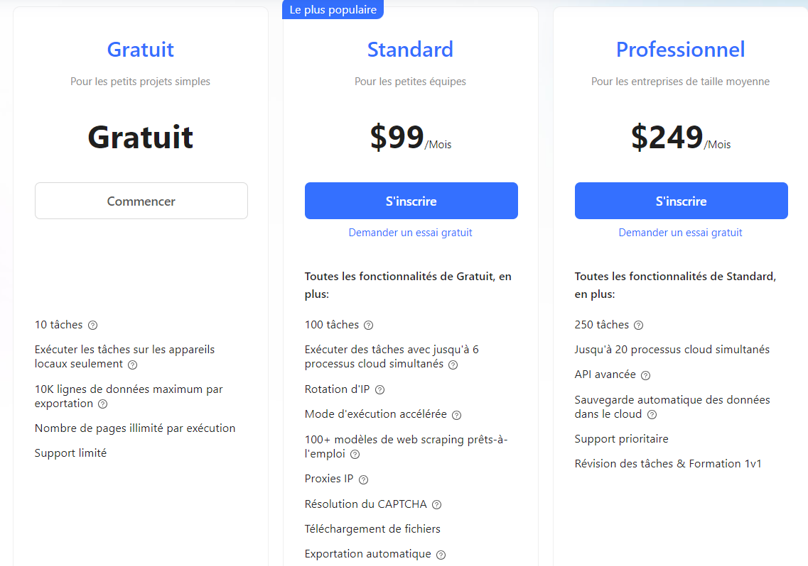
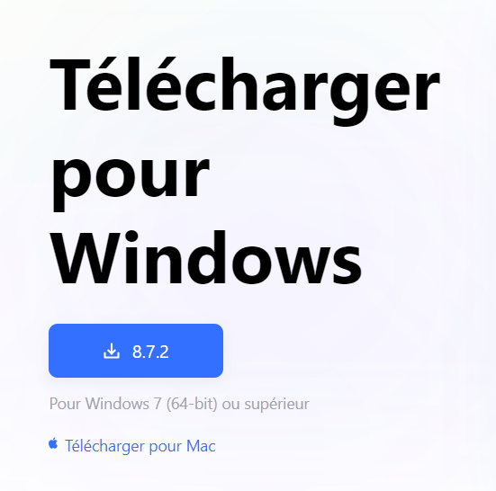
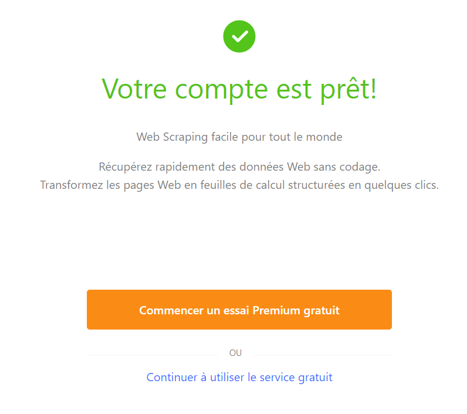

# Octoparse 

**Octoparse** est une solution puissante et sans code pour le scraping de données. Il permet de configurer des projets de scraping de manière visuelle, sans avoir à coder. Octoparse est disponible en plusieurs langues, dont le français, et offre des fonctionnalités avancées telles que le scraping de sites dynamiques, la gestion de la pagination, et l'exportation de données au format CSV ou JSON.

## Installation et Inscription

### Étapes d'installation :

1. **Inscription** :
   - Rendez-vous sur le site [Octoparse](https://www.octoparse.fr) et créez un compte gratuit.
   - L'interface est disponible en français, facilitant la prise en main.

 

2. **Télécharger Octoparse** :
   - Octoparse propose une application de bureau pour Windows et macOS. [Téléchargez](https://www.octoparse.fr/download) et installez l'application sur votre ordinateur.

    

   
---

Octoparse, en plus d'offrir une version gratuite avec des fonctionnalités limitées, propose des réductions pour les étudiants, chercheurs, et organisations à but non lucratif. Ils accordent notamment une remise de 15 % sur le plan mensuel, 20 % sur le plan trimestriel, et 30 % sur le plan annuel pour les utilisateurs du secteur éducatif.

De plus, vous pouvez bénéficier d'une réduction allant jusqu'à 50 % si vous acceptez de mentionner le logiciel Octoparse dans votre article.

[Lire ici pour en savoir plus sur les reductions](https://helpcenter.octoparse.com/fr/articles/6471124-demandez-une-reduction-pour-l-education-l-exposition-ou-les-organisations-a-but-non-lucratif)

## Utilisation de Octoparse

Octoparse propose une large gamme de tutoriels ainsi qu'un guide complet pour débutants, disponibles gratuitement en consultation 

### [Bienvenue sur Octoparse!](https://helpcenter.octoparse.com/fr/articles/6470918-bienvenue-sur-octoparse)

### [Découvrir Octoparse](https://helpcenter.octoparse.com/fr/articles/6470919-lecon-0-decouvrir-octoparse)

### [Démarrer par l'auto-détection](https://helpcenter.octoparse.com/fr/articles/6470921-lecon-1-demarrer-par-l-auto-detection)

### [Optimiser votre tâche](https://helpcenter.octoparse.com/fr/articles/6470922-lecon-2-optimiser-votre-tache)

### [Affiner les données](https://helpcenter.octoparse.com/fr/articles/6470923-lecon-3-affiner-les-donnees)

### [Tester votre tâche](https://helpcenter.octoparse.com/fr/articles/6470924-lecon-4-tester-votre-tache)

### [Récupérer les données](https://helpcenter.octoparse.com/fr/articles/6470925-lecon-5-recuperer-les-donnees)

### [Planifier des exécution régulières](https://helpcenter.octoparse.com/fr/articles/6470926-lecon-6-planifier-des-execution-regulieres)

### [Allez-y! Créez votre première tâche!](https://helpcenter.octoparse.com/fr/articles/6470927-lecon-7-allez-y-creez-votre-premiere-tache)

---

## Exercice Pratique

### Objectif

Utiliser Octoparse pour extraire des titres et des dates d'un site d'actualités.

### Étapes

1. **Installer Octoparse** et créer un compte gratuit.
2. **Créer un nouveau projet** et entrer l'URL du site à scraper.
3. **Sélectionner les éléments** : titres et dates des articles.
4. **Configurer la pagination** pour extraire plusieurs pages.
5. **Lancer le scraping** et collecter les données.
6. **Exporter les données** au format CSV.
7. **Vérifier les données** dans un tableur.

---

## Conclusion

Octoparse est une alternative puissante et facile à utiliser. Il dispose de modèles préconfigurés capables d'extraire des données de presque tous les sites web (généralement dans les versions payantes), allant de Twitter à YouTube, Amazon, et même TikTok, entre autres. Avec son interface graphique intuitive et sa prise en charge du scraping de sites dynamiques, il s'agit d'une excellente option pour les utilisateurs sans expérience en programmation.

---