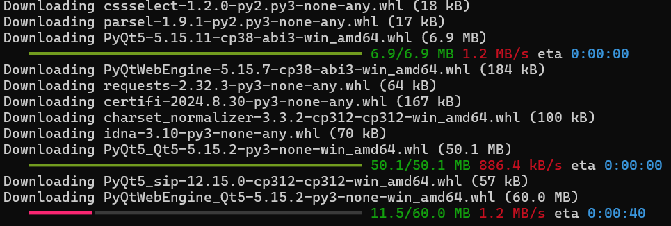
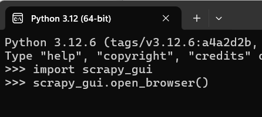
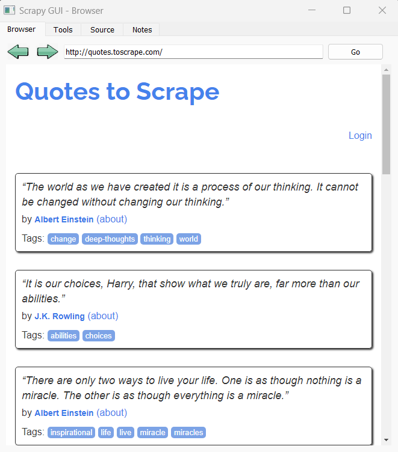
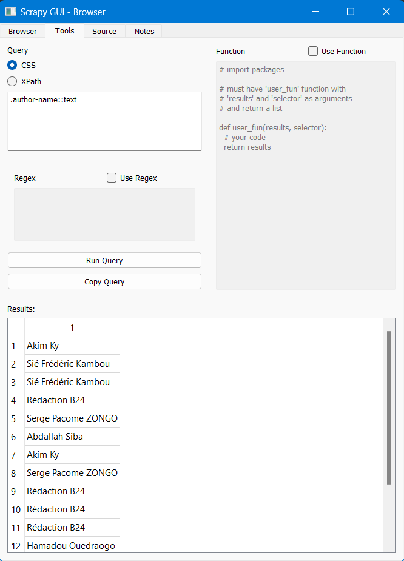

# Scrapy-GUI

**Scrapy-GUI** est une interface graphique pour le célèbre framework Scrapy, permettant de créer des spiders et de scraper des données sans écrire de code. Il rend l'utilisation de Scrapy accessible aux utilisateurs non techniques via une interface visuelle.

## Installation de Scrapy-GUI

### Étapes d'installation :

1. Assurez-vous d'avoir [**Python**](https://etudestech.com/decryptage/comment-installer-python/){:target="_blank"} installé sur votre machine. [Download ici](https://www.python.org/downloads/){:target="_blank"}.  
2. Installez **Scrapy-GUI** via pip en exécutant la commande suivante :
```bash
    pip install scrapy-GUI
```


3. Une fois installé, lancez l'application avec la commande suivante :
```bash
    scrapy-gui 
    ou 
    scrapy_gui.open_browser()
```


Cela ouvrira l'interface graphique de Scrapy où vous pourrez configurer vos projets de scraping.


## Utilisation de Scrapy-GUI

### Étape 1 : Onglet "Browser"

- Après avoir ouvert l'interface
- Entrez l'URL du site web que vous souhaitez scraper 


### Étape 2 : Onglet "Tools" -- Définir les éléments à scraper

- L'onglet Outils contient différentes sections permettant d'analyser le contenu de la page. Le but de cet onglet est de faciliter le test des requêtes et du code à utiliser dans un **scrapy spider**.
- Par exemple, pour obtenir les auteurs des articles de la section politique, nous pouvons utiliser la requête suivante (voir image)





## Conclusion

Comme vous l’aurez compris, cet outil nécessite un minimum de compétences techniques, mais il est important de le connaître au cas où il serait nécessaire. Pour approfondir, consultez ce [tutoriel](https://docs.scrapy.org/en/1.0/intro/tutorial.html){:target="_blank"}.