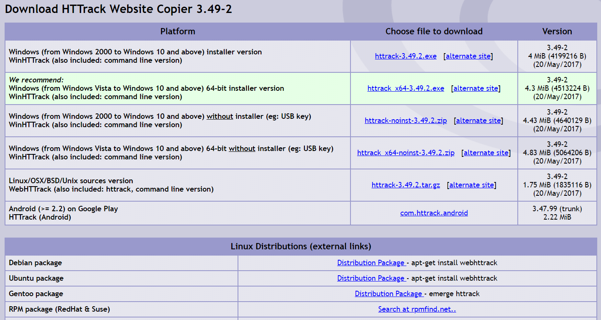
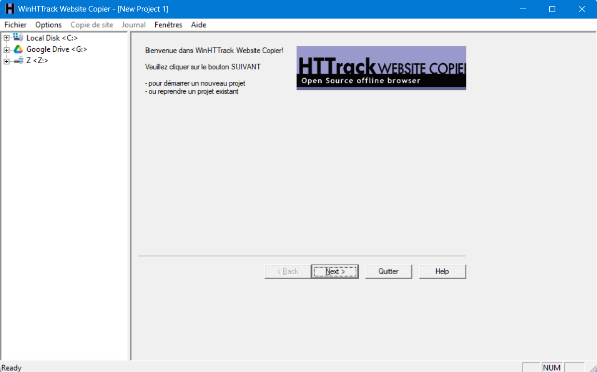
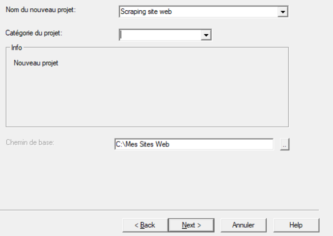
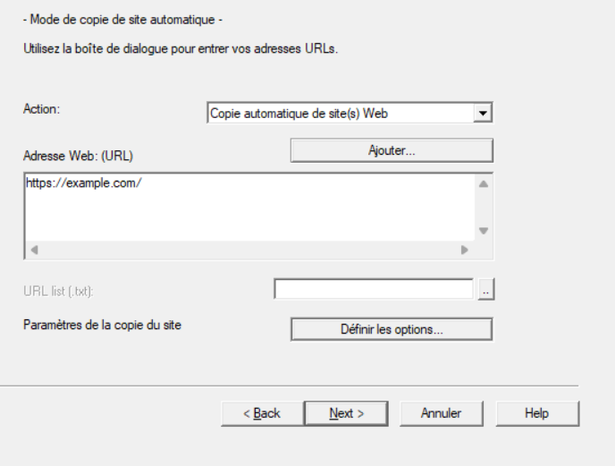
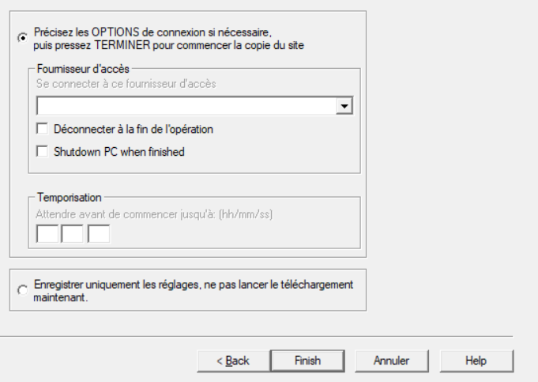

## 1. **HTTrack**

### Qu'est-ce que HTTrack ?

HTTrack est un logiciel libre et open-source qui vous permet de télécharger et copier des sites web pour les consulter hors ligne. Il est particulièrement utile pour le scraping de sites web statiques ou semi-dynamiques.

### Installation de HTTrack

Pour installer HTTrack :

1. **Téléchargez HTTrack** depuis [ce lien](https://www.httrack.com/page/2/en/index.html).

 
2. Installez le logiciel en suivant les instructions sur votre système d’exploitation (Windows, [macOS](https://lucidgen.com/en/how-to-use-httrack-on-mac/#:~:text=like%20a%20coder%E2%80%9D.-,Install%20HTTrack%20on%20Mac,can%20install%20HTTrack%20for%20Macbook.), Linux).

### Utilisation de HTTrack

<iframe width="560" height="315" src="https://www.youtube.com/embed/uEJgmOK0QbA?si=sFGFXgT_1sw1kr1w" title="YouTube video player" frameborder="0" allow="accelerometer; autoplay; clipboard-write; encrypted-media; gyroscope; picture-in-picture; web-share" referrerpolicy="strict-origin-when-cross-origin" allowfullscreen></iframe>

Une fois installé, voici comment utiliser HTTrack pour copier un site web :

 

1. **Lancez HTTrack** et cliquez sur "Suivant" pour commencer un nouveau projet.
2. **Nom du projet** : Donnez un nom à votre projet, par exemple "Scraping site web".
3. **Catégorie** : Vous pouvez laisser cette option par défaut ou créer une nouvelle catégorie.

 

4. **Adresse Web (URL)** : Entrez l’URL du site web que vous souhaitez copier. Par exemple, `https://example.com`.
5. **Choisissez l'option de téléchargement** : Vous pouvez choisir de copier uniquement certaines parties du site, comme les pages HTML, ou tout le contenu (images, scripts, etc.).

 

6. **Lancez le téléchargement** : Cliquez sur "Terminer / Finish" pour démarrer le processus. HTTrack commencera à copier le site sur votre disque local.

 

7. **Consultation hors ligne** : Une fois le site copié, vous pourrez ouvrir les fichiers HTML directement depuis votre disque dur, en naviguant comme si vous étiez en ligne.

### Astuces et limitations de HTTrack

- **Limitation** : HTTrack fonctionne très bien avec des sites statiques, mais peut avoir des difficultés avec des sites très dynamiques (comme ceux qui utilisent beaucoup de JavaScript).
- **Attention à l'éthique** : Assurez-vous de vérifier les conditions d’utilisation des sites avant de les scraper avec HTTrack.

---

## Exercice pratique

**Objectif** : Utiliser HTTrack pour copier un petit site web statique.

1. Téléchargez HTTrack et installez-le.
2. Choisissez un site web simple (par exemple, un blog ou un site de documentations).
3. Suivez les étapes ci-dessus pour copier le site sur votre ordinateur.
4. Naviguez sur le site copié hors ligne.

---

<iframe width="560" height="315" src="https://www.youtube.com/embed/uEJgmOK0QbA?si=sFGFXgT_1sw1kr1w" title="YouTube video player" frameborder="0" allow="accelerometer; autoplay; clipboard-write; encrypted-media; gyroscope; picture-in-picture; web-share" referrerpolicy="strict-origin-when-cross-origin" allowfullscreen></iframe>

## Conclusion

Dans cette section, vous avez appris à utiliser HTTrack pour extraire et copier des sites web. C'est un outil très utile pour le scraping de sites statiques, et il est facile à prendre en main même pour les débutants.