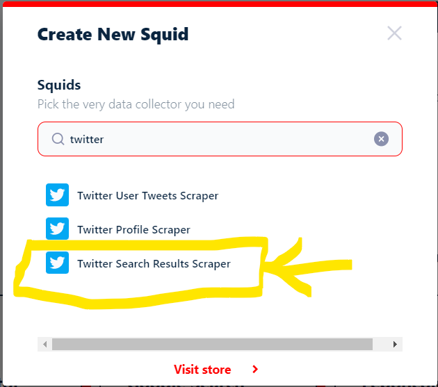

# Lobstr

**Lobstr** est un outil en ligne qui facilite l'extraction de données comme Octoparse sans nécessiter de compétences en programmation. Il est particulièrement utile pour les chercheurs, les analystes et toute personne souhaitant collecter des **tweets** sur des sujets spécifiques, des hashtags ou des comptes utilisateurs. En effet, même en mode gratuit, Lobstr nous permet d'extraire des données de X, bien que de manière limitée, évidemment !

## Description de Lobstr

### 1. **Facilité d'utilisation**

- **Interface intuitive** : Lobstr propose une interface conviviale qui permet de configurer des requêtes de recherche Twitter sans effort.
- **Pas de codage requis** : aucune compétence en programmation n'est nécessaire pour utiliser cet outil.

### 2. **Collecte de données depuis Twitter**

En commençant par les modules de scraping pour X (Twitter), Lobstr propose 3 scrapers pour extraire des données des **profils Twitter**, des **tweets des utilisateurs** et même des **tendances Twitter et des résultats de recherche d'un hashtag par exemple**.

Avec plus de 420 millions d'utilisateurs actifs par mois, X est l'une des plateformes de médias sociaux les plus engageantes. L'extraction des données Twitter peut aider à :

- Spécialistes du marketing : suivre les mentions de marque, les performances des campagnes et analysez le sentiment autour de vos   produits ou services.
- Chercheurs : étudier l'opinion publique, suivez les mouvements sociaux et analysez les tendances linguistiques sur Twitter.
- Entreprises : identifier les prospects potentiels, recueillez les commentaires des clients et améliorez le service client global.
- Analyse concurrentielle : surveiller ce que les gens disent des produits, des services et de l'image de marque globale de vos concurrents.
- Formation de modèles d'apprentissage automatique : entraîner divers modèles d'apprentissage automatique tels que des classificateurs d'analyse des sentiments, des algorithmes de modélisation de sujets, etc.

#### Comment extraire les résultats de recherche Twitter sans coder ?

La meilleure façon (simple) d’extraire les données Twitter est d’utiliser des outils sans code. C’est ce que nous allons faire. Nous utiliserons Twitter Search Results Scraper de lobstr, le meilleur scraper Twitter sans code du marché -- pour le moment!

 

Lobster offre, contrairement à la plupart de ses concurrents, la possibilité d'utiliser ses services gratuitement, bien que de manière limitée évidemment, jusqu'à 15 minutes toutes les 24 heures pour une tâche ou un **squid**.

### 3. **Exportation des données**

- **Formats disponibles** : exportez les données collectées en formats CSV ou Excel pour une analyse ultérieure.
- **Compatibilité** : les fichiers exportés peuvent être utilisés avec des outils comme Excel, Google Sheets, ou des logiciels d'analyse statistique.

## Guide étape par étape pour extraire les résultats de recherche Twitter à l'aide de Lobstr.io

1. **Accéder à Lobster**

   - Rendez-vous sur le site officiel de Lobster : [Lobster](https://www.lobstr.io/){:target="_blank"}.

2. **Créer un compte**

   - Inscrivez-vous pour créer un compte gratuit si nécessaire.

    

    

3. **Obtenir l'URL de recherche Twitter**

La première étape consiste à obtenir l'URL de recherche sur Twitter.

Avec Lobstr, vous pouvez extraire les tweets les plus populaires et les plus récents de n'importe quelle tendance ou requête de recherche en copiant et collant simplement l'URL de recherche.

Nous allons extraire les tweets les plus populaires sur #AES publiés entre le 01 Janvier et le 31 Aout 2024 en langue francaise. Utilisons la recherche avancée de Twitter pour ajouter une plage de dates.

 

Lien : **https://x.com/search?f=live&q=(%23AES)%20lang%3Afr%20until%3A2024-08-31%20since%3A2024-01-01&src=typed_query**

4. **Créer un "Squid" et synchroniser votre compte Twitter**

Accédez à votre tableau de bord lobstr.io. Une fois connecté, cliquez sur le bouton "create a new Squid" et recherchez « Twitter ».

 

 

vous verrez une nouvelle fenêtre contextuelle vous demandant de synchroniser un compte Twitter.

 

```
  L'année dernière, X a décidé de cacher les tweets derrière la connexion pour empêcher l'extraction de données par l'IA. 
  Vous ne pouvez accéder aux données des tweets que si vous êtes connecté. C'est pourquoi Lobstr a besoin que vous synchronisiez votre compte
```
Pour synchroniser votre compte Twitter, il vous suffit [d'installer l'extension Chrome de synchronisation de compte Lobstr](https://chromewebstore.google.com/detail/lobstrio-account-sync/oelngbppodofbbffdicjmmmnhgcchokd){:target="_blank"}. Aucune information de connexion n'est requise, totalement sécurisé.

 

Une fois l'extension Chrome installé, cliquez sur ***Yes I want to sync***, et vous êtes prêt!

5. **Ajouter des tâches**
Cette étape est très simple. Collez simplement l'URL de recherche Twitter que vous avez copiée à **l'étape 3** et cliquez sur Add+


Après avoir ajouté des tâches, cliquez sur "Save" et vous verrez le menu des paramètres.

6. **Ajuster le comportement du squid** 

Dans les paramètres de base, vous pouvez choisir le nombre de tweets à extraire par tâche. Vous souhaitez extraire tous les tweets ? Laissez-le simplement vide. Vous n'avez besoin que de 10 tweets, définissez donc Max Results sur 10. 

Notez que, dans la version gratuite, lobstr vous permet d'exporter jusqu'à 30 tweets, choisissons donc 25 pour notre exemple. C'est déjà énorme, car tout autre service nécessiterait un abonnement initial pour extraire un tweet, car X leur facture bien sûr des accès API.


Si vous souhaitez collecter de nouveaux tweets à chaque exécution du scraper, sélectionnez la première option.

Si vous avez besoin de tous les tweets disponibles sur une requête/tendance de recherche, sélectionnez la deuxième option. Elle est idéale pour récupérer les tweets publiés dans des plages de dates spécifiques.

Après avoir ajusté le comportement du squid, cliquez sur Save pour passer aux notifications.


7. **Lancement**

Pour une collecte de données instantanée, vous pouvez lancer le scraper manuellement. Cliquez simplement sur le bouton "Save & Extract" et votre collecte de données commencera.


Mais que faire si je souhaite surveiller une tendance en continu et collecter de nouveaux tweets chaque semaine ou chaque jour ? C'est là que la fonction de planification entre en jeu.

Vous pouvez programmer l'extraction des résultats de recherche Twitter pour qu'elle s'exécute automatiquement et de manière répétée à l'heure et à la date de votre choix. Que ce soit toutes les heures, tous les jours, toutes les semaines ou tous les mois.


Pour notre exemple, nous allons opter pour une extraction manuelle pour obtenir instantanément nos données. Veuillez continuer...


8. **Impressionnant!**

Nous avons collecté en 17 secondes 25 tweets  les plus populaires avec 25 attributs de données, de **#AES**, filtrés par plage de dates!


9. **Profiter**

   - Une fois la collecte terminée, accédez à vos résultats. Vous pouvez afficher les résultats dans le tableau de bord 


   - ou les télécharger sous forme de fichier csv.


## Points forts de Lobster

- **Simplicité** : interface utilisateur facile à prendre en main, adaptée aux débutants.
- **Efficacité** : rapide dans la collecte de données pertinentes depuis Twitter.
- **Flexibilité** : permet de définir des critères de recherche précis pour une collecte ciblée.
- **Accessibilité** : aucune programmation ni abonnement payant requis pour les fonctionnalités de base.

## Conclusion

Lobster est un excellent outil pour collecter des données depuis Twitter sans avoir besoin de compétences en programmation ni d'abonnement payant. Il simplifie le processus de collecte et d'exportation des données, permettant aux utilisateurs de se concentrer sur l'analyse.
