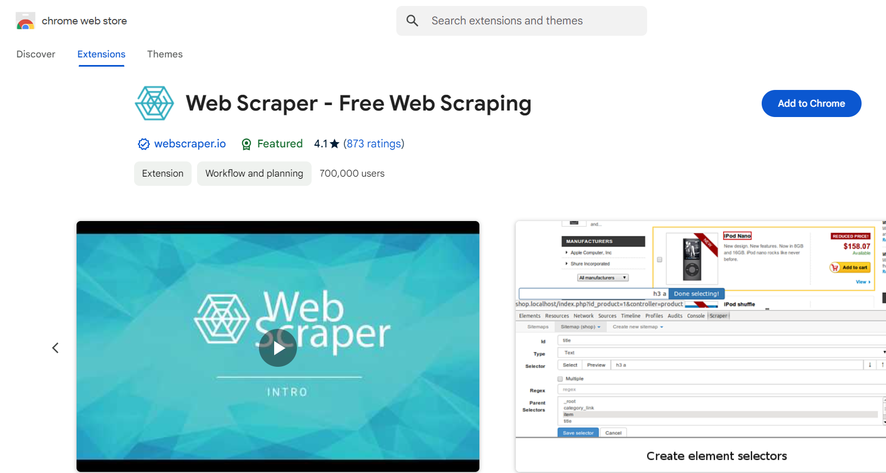
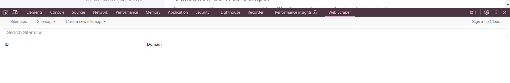
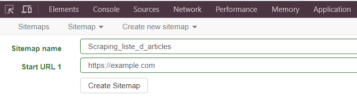

# Web Scraper (Extension Chrome)

**Web Scraper** est une extension gratuite pour le navigateur Chrome qui vous permet de scraper des données depuis des pages web. Il est idéal pour les utilisateurs sans compétences en programmation qui souhaitent collecter des informations structurées telles que des tableaux, des listes ou des articles.

## Introduction à Web Scraper

### Qu'est-ce que Web Scraper ?

Web Scraper est un outil très intuitif permettant de créer des plans de scraping (appelés **sitemaps**) pour extraire des données de manière automatique. Vous pouvez configurer l'extension pour capturer différents types de données (texte, images, URLs) en fonction de la structure des pages web.

### Pourquoi utiliser Web Scraper ?

- **Gratuit et facile à utiliser** : Aucune compétence en programmation n'est nécessaire.
- **Interface intuitive** : Configurez les sitemaps directement via l'extension Chrome.
- **Compatibilité** : Fonctionne bien avec les sites statiques et semi-dynamiques.

## Installation de Web Scraper

### Étapes d'installation :

1. **Ajouter l'extension à Chrome** :

   - Rendez-vous sur le **Chrome Web Store** via [ce lien](https://chrome.google.com/webstore/detail/web-scraper/jnhgnonknehpejjnehehllkliplmbmhn){:target="_blank"}.
   
     

   - Cliquez sur **Ajouter à Chrome** pour installer l'extension.

2. Une fois installée, vous verrez l'icône de Web Scraper dans la barre d'outils de votre navigateur.

---

## Utilisation de Web Scraper

Voici un guide étape par étape pour utiliser Web Scraper et extraire des données à partir d'une page web.

### Étape 0 : Ouvrir la barre d'outils Web scraper

- Ouvrir le menu du navigateur
- Cliquer sur Plus d'outils
- Cliquer sur Outils de développement
- Déplacer les outils de développement vers le bas
- Ouvrir l'onglet Web Scraper

[Voir en video ici](https://youtu.be/3_jKuq5CJdY?list=TLGGKtf7KLGt-gkxOTA5MjAyNA){:target="_blank"}

### Étape 1 : Créer un nouveau sitemap

- Cliquez sur l'icône **Web Scraper** dans la barre d'outils de Chrome.
- Cliquez sur **Sitemaps** puis sur **Create new sitemap**.
- Entrez l'URL du site web que vous souhaitez scraper (par exemple, `https://example.com`).
- Donnez un nom à votre sitemap (par exemple, "Scraping_liste_d_articles"). Notez que dans le nom, seules les lettres, les chiffres (0-9) ou l'un des caractères _, (, ), +, - sont autorisés.

### Étape 2 : Ajouter des sélecteurs

- Après avoir créé le sitemap, cliquez sur **Add new selector**.
- Sélectionnez un élément de la page (par exemple, les titres des articles ou les dates).
  - Vous pouvez cliquer directement sur les éléments à scraper dans la page pour les ajouter comme sélecteurs.
- Donnez un nom à chaque sélecteur (par exemple, `titre` ou `date`).
- Choisissez le type de données que vous voulez extraire (par exemple, **texte** ou **lien**).
- Répétez ces étapes pour chaque élément que vous souhaitez scraper.

### Étape 3 : Configurer la pagination

Si la page web que vous scrapez a plusieurs pages, vous pouvez configurer la pagination pour scraper plusieurs pages à la fois.

- Ajoutez un nouveau sélecteur pour les boutons **Suivant** ou **Page suivante**.
- Sélectionnez **Link** comme type de sélecteur.
- Web Scraper suivra ces liens pour extraire des données sur plusieurs pages.

### Étape 4 : Exécuter le scraping

- Une fois que tous vos sélecteurs sont configurés, cliquez sur **Scrape** pour commencer l'extraction des données.
- Web Scraper ouvrira un nouvel onglet et commencera à parcourir les pages pour scraper les données.
- Vous verrez un indicateur de progression pendant que les données sont extraites.

### Étape 5 : Exporter les données

- Une fois le scraping terminé, vous pouvez exporter les données collectées.
- Cliquez sur **Export Data** et choisissez le format d'exportation : **CSV** ou **XLSX**.
- Ouvrez le fichier exporté dans un tableur ou un autre logiciel pour analyser les données.

---

[https://webscraper.io/web-scraper-first-time-install](https://webscraper.io/web-scraper-first-time-install){:target="_blank"}

## Exercice pratique

### Objectif

Utiliser Web Scraper pour extraire les titres et les dates des articles d'un blog ou d'un site d'actualités.

### Étapes

1. **Installer l'extension Web Scraper** via le Chrome Web Store.
2. **Créer un nouveau sitemap** et ajouter l'URL du site à scraper.
3. **Ajouter des sélecteurs** pour extraire les titres et les dates de publication.
4. **Configurer la pagination** pour extraire les données de plusieurs pages.
5. **Exécuter le scraping** et collecter les données.
6. **Exporter les données** au format CSV ou JSON.
7. **Ouvrir et vérifier les données** dans un tableur (par exemple, Google Sheets ou Excel).

---

## Avantages et limitations

### Avantages

- **Gratuit** : Web Scraper est entièrement gratuit à utiliser.
- **Facilité d'utilisation** : pas besoin de compétences en programmation.
- **Compatible avec Chrome** : fonctionne directement dans le navigateur, sans installation complexe.

### Limitations

- **Sites dynamiques** : web Scraper peut avoir des difficultés avec des sites qui chargent dynamiquement du contenu via JavaScript.
- **Données volumineuses** : peut ne pas être idéal pour scraper de très grandes quantités de données ou des sites complexes.

---

## Conclusion

Web Scraper est une solution simple et efficace pour scraper des données directement depuis des pages web, sans avoir à écrire du code. Grâce à son interface intuitive, il est accessible aux débutants tout en offrant des fonctionnalités puissantes pour extraire des données structurées.

---