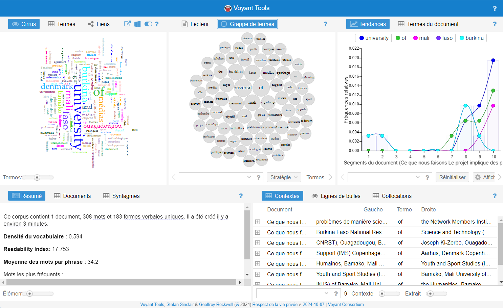

# Outils pour l'analyse textuelle sans codage

## Orange Data Mining

- **Présentation** : [Orange](https://orangedatamining.com/){:target="_blank"} est une suite logicielle open-source d'analyse de données qui propose des widgets pour le machine learning et la visualisation.
- **Fonctionnalités pour le texte** :
  - Prétraitement du texte.
  - Visualisation des données textuelles.
  - Modélisation de sujets.
  - Analyse de sentiment.
- **Avantages** :
  - Interface glisser-déposer.
  - Pas besoin de programmation.
  - Communauté active et nombreux tutoriels.

## Autres outils 

- **Voyant Tools** : application web pour l'analyse textuelle en ligne.
  - Site web : [https://voyant-tools.org/](https://voyant-tools.org/?lang=fr){:target="_blank"}
  - Guide d'utilisation : [https://edutechwiki.unige.ch/fr/Voyant_Tools](https://edutechwiki.unige.ch/fr/Voyant_Tools){:target="_blank"}

  
  
- **KH Coder** : logiciel pour l'analyse quantitative de données textuelles.
  -  - Site web : [https://khcoder.net/en/](https://khcoder.net/en/){:target="_blank"}

# Installation Orange Data Mining

## Sur Windows 

### En bref
- Téléchargez et ouvrez le fichier d'installation d'Orange3 [ici](https://orangedatamining.com/download/){:target="_blank"}.
- Suivez l'assistant d'installation pour installer Orange 3 et ses dépendances (Python 3.4, NumPy, etc.).
- Installez le module complémentaire Text.
- Redémarrez l'application.
- Continuez avec l'étape [Test](#test-de-lenvironnement).

### Instructions détaillées

Téléchargez le [fichier d'installation](https://orangedatamining.com/download/){:target="_blank"} et enregistrez-le dans un emplacement arbitraire. Démarrez l'installation en double-cliquant sur le fichier téléchargé. Choisissez Oui lorsqu'on vous demande si vous souhaitez autoriser ce programme à apporter des modifications à votre ordinateur.

Le programme d'installation vous demandera de confirmer l'installation de Miniconda (pour python) sur votre ordinateur. Appuyez sur OK. Si Python est déjà installé, cette étape n'est pas nécessaire.

Suivez l'assistant d'installation pour installer Miniconda. Vous pouvez conserver les paramètres par défaut et attendre la fin de l'installation. Après, l'assistant installera Orange 3 et ses dépendances. Cette étape peut prendre un certain temps.

Double-cliquez sur l'icône du bureau Orange pour démarrer l'application Orange.

Pour installer les widgets **Text et Textable** , suivez le menu Options->Add-Ons... Dans le champ de texte, recherchez "text", puis cochez la case Text et textable et appuyez sur OK. Cela nous donnera acces à des analyses textuelles!

Pour que les modifications prennent effet, vous devez redémarrer l'application. Fermez la fenêtre principale d'Orange, puis double-cliquez sur l'icône Orange sur le bureau pour redémarrer l'application Orange. 

## Sur Mac OS X

### En bref
Téléchargez la dernière version d'Orange (c'est-à-dire un fichier d'installation dmg) depuis le site Web d'[Orange Data Mining](https://orangedatamining.com/download/){:target="_blank"}, installez-la sur votre système et passez à l'étape [Test](#test-de-lenvironnement).

### Instructions détaillées

Téléchargez la dernière version 

 

Ouvrez le fichier d'installation en double-cliquant sur son icône.

Une fenêtre comme celle ci-dessous devrait s'ouvrir. Faites glisser l'icône orange et relâchez-la sur l'icône Applications.

 

Vous pouvez maintenant ouvrir Orange à partir de votre dossier Applications. Ouvrez simplement le dossier Applications, recherchez l'application nommée Orange, cliquez sur son icône pour la sélectionner et ouvrez-la en choisissant Ouvrir dans le menu Fichier du Finder. ***Vous devez utiliser cette procédure au lieu d'un double clic pour ouvrir Orange, c'est-à-dire des applications non enregistrées, pour la première fois.***

 

Installez le module complémentaire **Text** en sélectionnant Modules complémentaires dans le menu Options

## Test de l'environnement

Vous devriez voir un écran de bienvenue comme celui illustré ci-dessous lorsque vous démarrez Orange. Choisissez **Examples**. Vous pouvez également accéder aux tutoriels en sélectionnant **Examples** dans le menu Aide.

Une fenêtre comme celle ci-dessous s'ouvrira.

Sélectionnez le flux de travail **File and Data tables** et cliquez sur ***Open*** pour l’ouvrir.

That's it, Bravo!

